# FX Chatbot (HR assistant POC)

An HR adviser for **small business owners with no HR department**, as a CLI and as a browser UI (MeritAI, `npm run ui`). It tells them what to do and does as much of the work as it can. The AI engine is a local `codex app-server` with its own isolated configuration, running on the owner's own ChatGPT account. This is a proof of concept, tested internally by the HR team playing small business owners.

## What it helps with

| Area | How |
|---|---|
| Your business | `/setup`: a 3-minute interview that builds the business profile (name, states, employment types, awards, pay, benefits and rules, who signs letters, your HR or legal adviser). Your own policies go in `files/Policies` |
| Recruitment | `job-description`, `resume-screening`, `interview-kit`, `candidate-email`; bulk screening of a job folder (results in the chat; Word or Excel report on request) |
| Hiring | `employment-contract`: letter of offer + employment contract (full-time, part-time, casual, fixed-term) from the business profile, marked DRAFT; the new starter compliance checklist (information statements, TFN, super, right to work, pay records) with official links |
| Onboarding | `onboarding-plan` (includes the compliance checklist) |
| Reminders | Worked out from the register: paperwork not recorded, probation ends, visa expiries, fixed-term ends, casual information statements and the right to ask for permanent work, 1 July wage changes |
| Employee register | Who works here: role, type, dates, award, probation and visa expiry, and which starting documents they have received (no TFN, bank, address, date of birth or health data) |
| Performance | `performance-review` (with a bias check on wording) |
| Difficult conversations / ER | `difficult-conversation`: process guidance only; says where to get advice (your adviser, an employment lawyer, the Fair Work Infoline). Decision letters are marked DRAFT |
| Offboarding | `offboarding` |
| Award and pay | `award-finder`: the likely award and classification with reasons and official sources, plus the Fair Work tools to confirm pay. It never calculates pay: a warning shows if a reply contains pay arithmetic |
| Policy and law questions | Your business profile and policies, plus official Australian government sources |

## Using MeritAI (user guide)

The screenshots and the video come from the demo: the made-up sample business **Wattle Lane Cleaning** (synthetic data) and the demo engine (scripted replies, no model). With the real adviser the replies are its own; everything else looks the same.


*Above: "Hannah Cole accepted the Team leader offer…". The adviser finds her application, asks once, and saves. Staff and Hiring update at once: Hannah is marked "New · MeritAI" and the job counts the hire. ([MP4](docs/images/hire-in-the-chat.mp4))*

### 1 Start

Install the desktop app (`MeritAI Setup <version>.exe` from the GitHub releases) or run `npm run ui`. The first run asks you to:

1. sign in with ChatGPT;
2. choose where your files go;
3. set up your business.

To look around first, choose **Try it with a sample business**. It opens a made-up cleaning business with staff, jobs and paperwork due, kept in its own folder. The **Sample data** label at the top switches back to your own business.

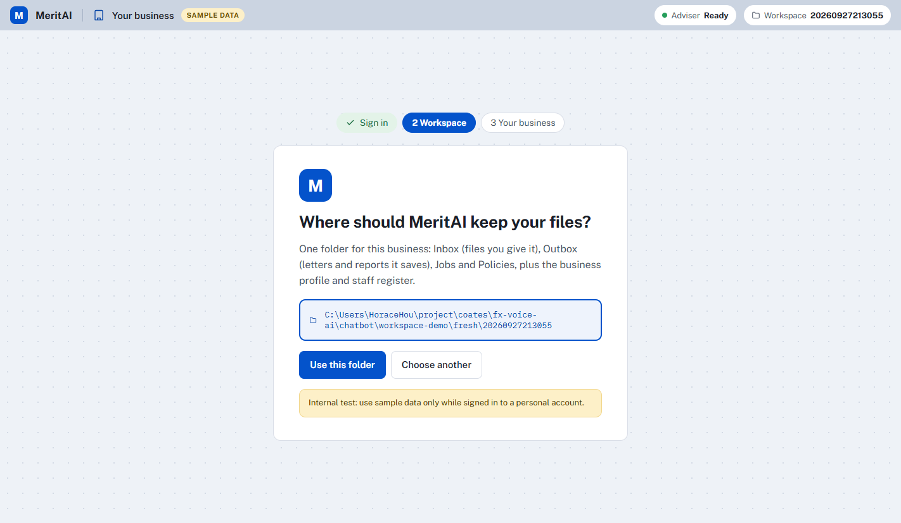

### 2 Getting around

- **Conversations**: talk to the adviser.
- **Staff**: the register.
- **Hiring**: jobs, screening and your decisions.
- **Profile & policies**, **Files**: what the adviser knows about the business.
- **Connections**: what's coming.
- **Attention** (the right-hand panel on Conversations): what is overdue or due soon, worked out from the register.
- **Your name** (bottom left): Memory, Settings and Send feedback.

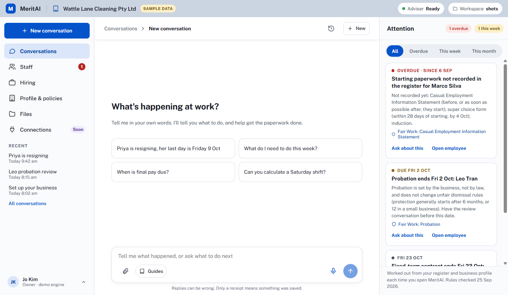

### 3 Tell it what happened: it does the paperwork, after your OK

Say it in your own words ("Priya resigned, her last day is Friday 9 October", "Hannah accepted the offer"). The adviser tells you what to do, with official sources.

**Saving:** anything it wants to save (the register, a job, the business profile) comes as a **Needs your OK** card. Nothing changes until you say yes, and only a green receipt means something was saved.

**What changed:** under the reply you see what it changed, as it is now, with the next step:
- **Record paperwork** for a new starter;
- **Close the job** when everyone it needs is hired.

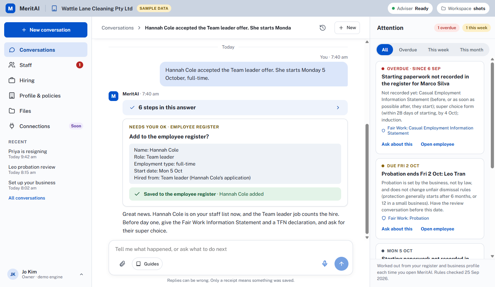

### 4 The pages keep up

The conversation and the pages stay in step, whether you type, talk, or use the side panel.

- **Pages update at once:** an open page updates the moment something is saved.
- **Changed rows are marked:** rows the adviser changed show **New · MeritAI** or **Updated · MeritAI** for a few minutes.
- **A dot on the navigation:** marks pages the adviser changed while you were elsewhere. Opening one shows a short note of what changed, linking back to the conversation.
- **A hire said in the chat counts on the job:** the same as **Add to Staff** on the Hiring page.

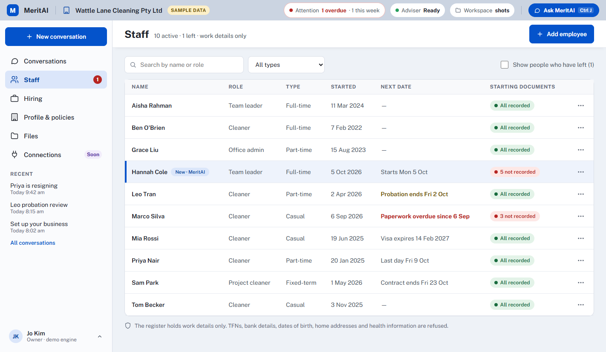
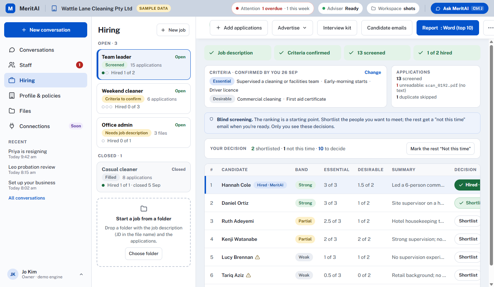

### 5 Ask from any page: the side panel

**Ask MeritAI** (top right, or Ctrl J) opens the conversation next to the page you are on. The page stays in view and updates as you answer the adviser's questions.

A button on a page (Interview kit, Draft the letter, Ask about this…) sends its request there. It continues the conversation when it's about the same thing; otherwise it starts a new one and links back to the old one.

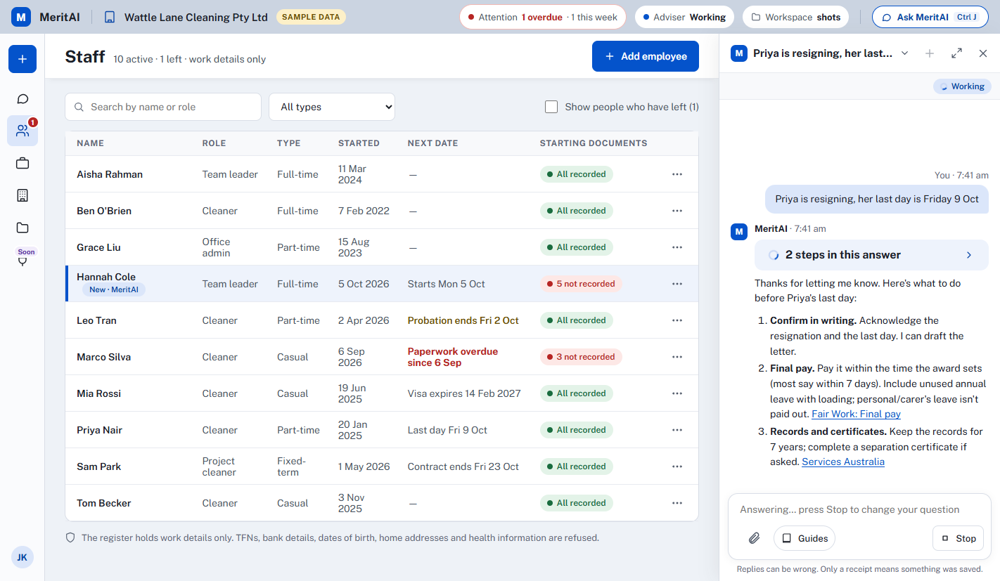
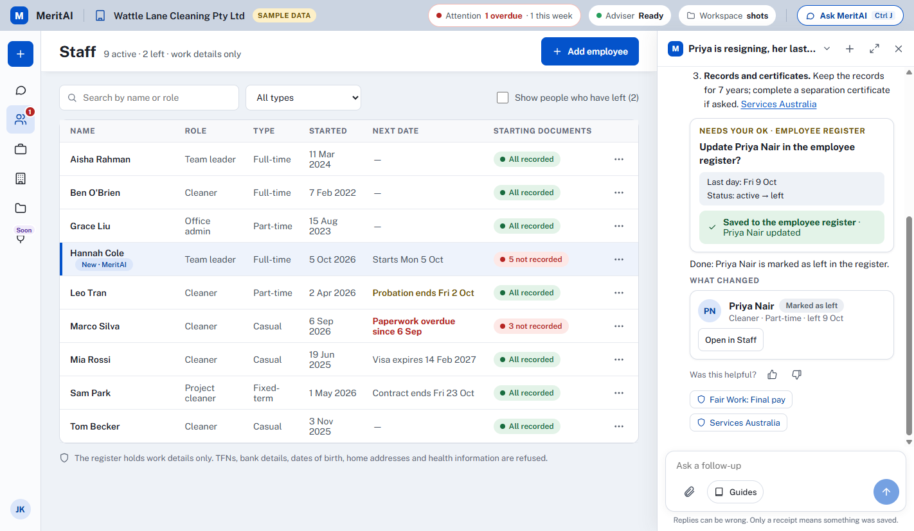

### 6 Hiring

**The screening flow:**
1. A job has a job description and applications. Drop a folder, or use **Add applications**.
2. The adviser drafts screening criteria from the JD, and you confirm them.
3. Every application is assessed on its own, blind (no names, photos, ages or addresses), and ranked by rules.
4. You decide: **Shortlist** or **Not this time**.
5. Next steps: an interview kit, candidate emails as drafts, and **Add to Staff** for the person you hire.

You can also make any of these decisions just by telling the adviser.

**New job:**
- **From a template:** 35 common roles in 10 industries, your own industry first. You can search by any name ("chef", "sparky").
- The job description on the right follows what you choose. Bracketed parts are yours to fill in.
- The likely award is shown as a hint to confirm with the Award finder. MeritAI never works out pay.
- **Create job** saves the JD into the new job. **Create and ask MeritAI to tailor it** also has the adviser fill in what it can from your profile.
- The other tabs: **My own job description** (upload a file) and **Write it with MeritAI**.

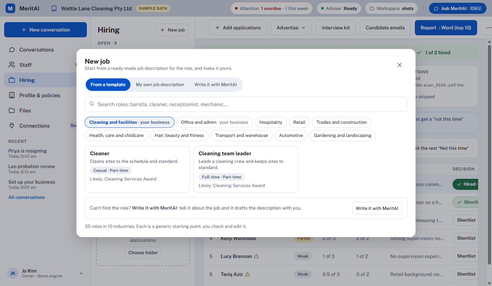
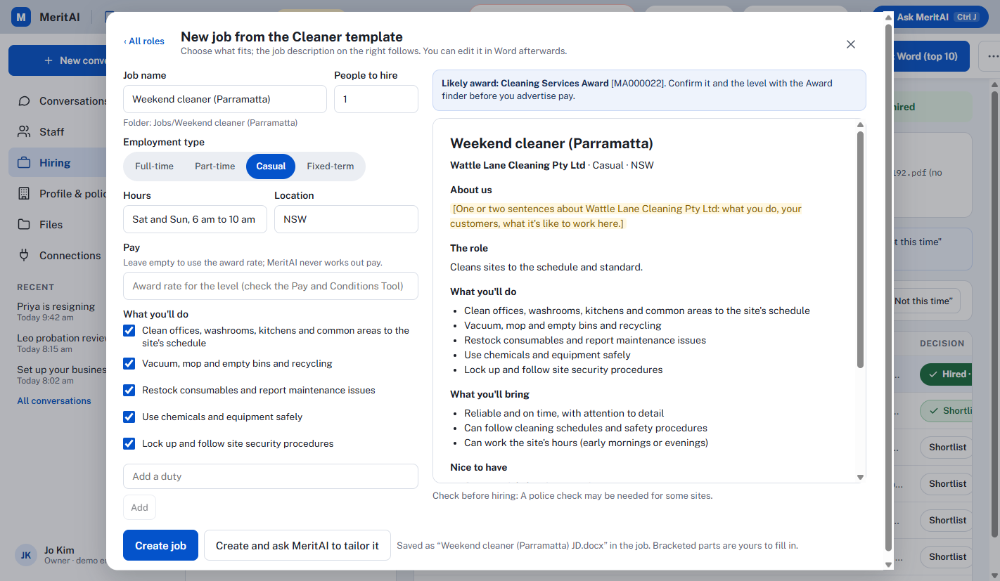

**Advertise** writes the job ad with the adviser. Posting to SEEK, LinkedIn Jobs and Indeed is coming.

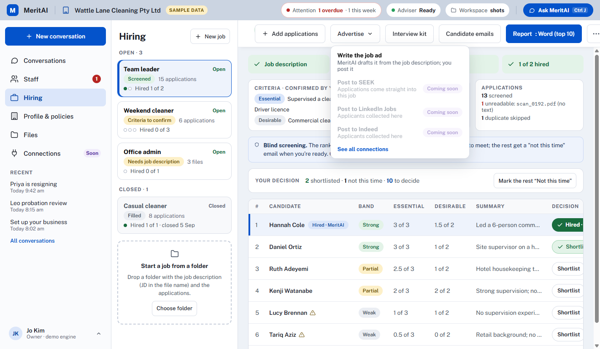

### 7 Emails: drafts you send yourself

MeritAI never sends email. Ask for an email (an offer with the contract, an interview invite, a letter) and it saves a draft with the files attached.

**Open in email app** opens it in Outlook (or your default mail app) as a new message: check it, then press Send there. Sending from MeritAI is coming (see Connections).

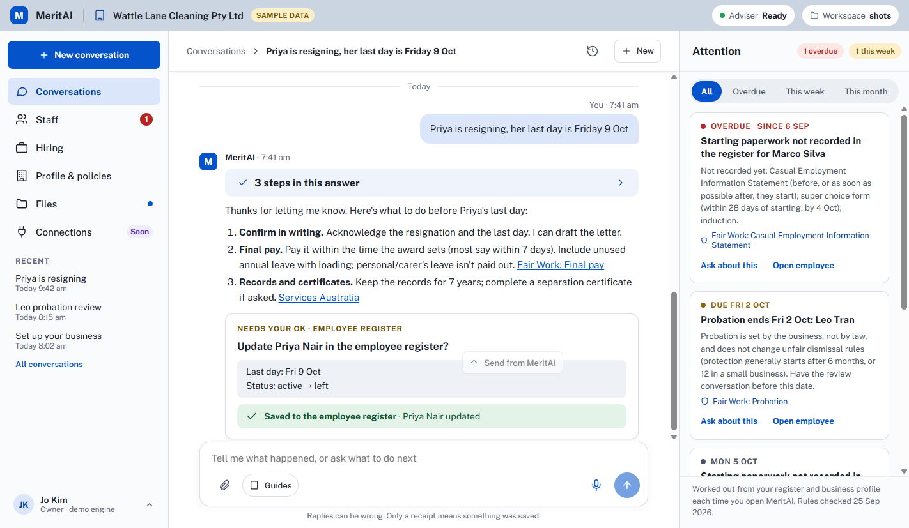

### 8 Voice

The microphone in Conversations. It needs your own OpenAI API key in Settings, costs about US$0.05 a minute, and the demo has a free stand-in voice.

Talk as you would on the phone. While you talk, the right-hand panel becomes **On screen** and shows what the conversation is about.

**Saving during voice:**
- A change that needs your OK waits there: press **Yes, save**, or say "yes".
- Deleting always needs a press.

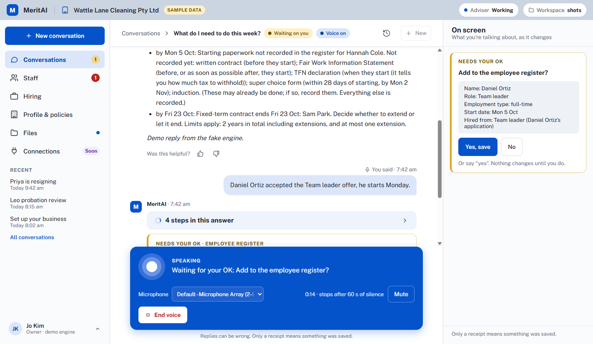
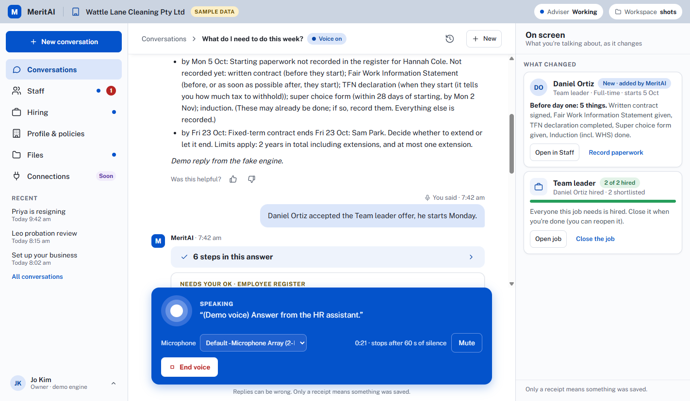

### 9 Settings

- **Language · 语言**: English or 中文. In Chinese the app and the adviser's replies are in Chinese; letters, contracts, emails and job descriptions stay in English.
- **Voice**:
  - the API key: kept on this computer, encrypted, and only its last 4 characters are ever shown;
  - the microphone;
  - **Usage**: today, this month and all time, estimated in US$ (your OpenAI bill has the real amount);
  - a **monthly limit** that stops voice.
- **Workspace folder**, **Speed**, and **About** (including the plan and updates).

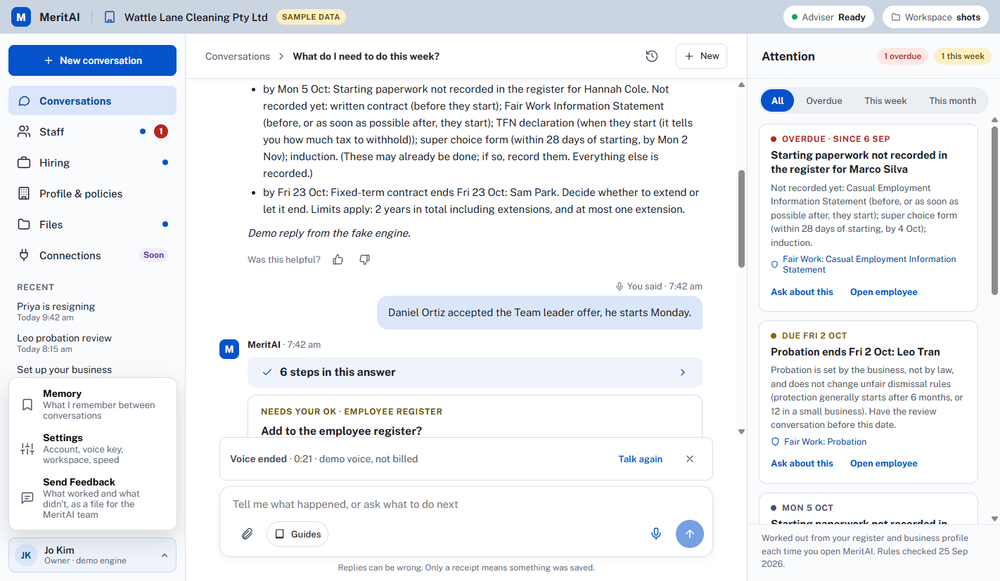
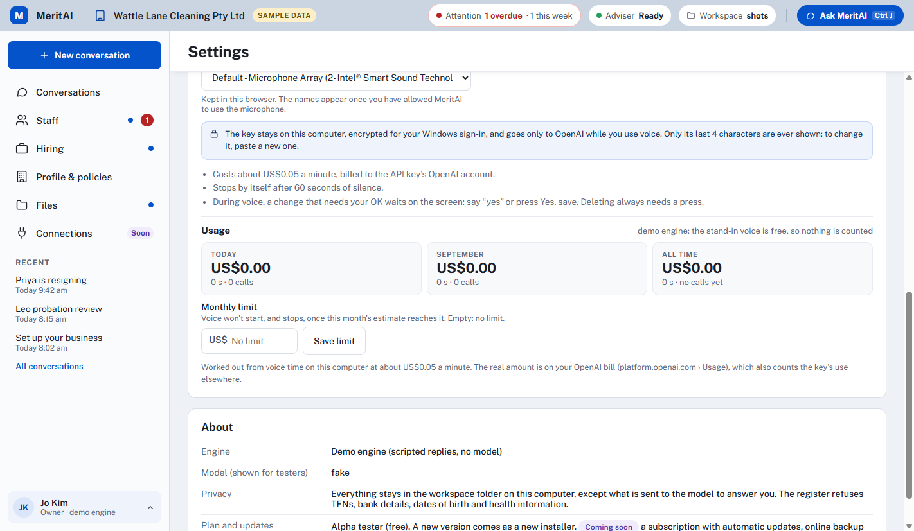

### 10 Connections (coming soon)

Today MeritAI runs only on this computer: it drafts, and you send.

**What it will connect to:**
- email and calendar (Outlook and Microsoft 365, Gmail);
- Teams and Slack;
- job boards (SEEK, LinkedIn Jobs, Indeed);
- payroll (Xero, MYOB, Employment Hero);
- Asana;
- online backup;
- a subscription with automatic updates.

Press **I want this** on the ones you'd use: it goes in your next feedback file.

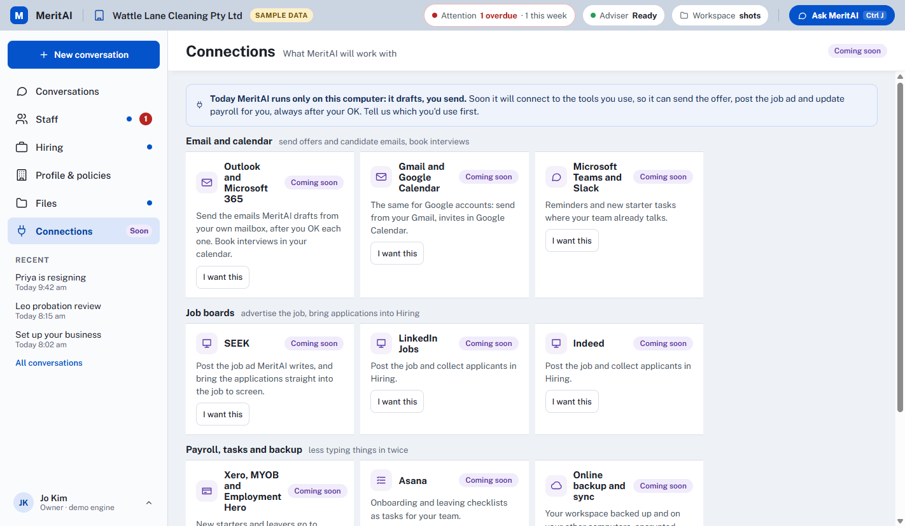

### 11 中文

Settings › Language · 语言 › 中文（简体）.

**Translated:** the whole app, including the dates, and the adviser answers in Chinese.

**Kept in English:**
- names, job titles and file names;
- documents for other people (Australian workplaces use English);
- the legal checklists' details (official English, with links).

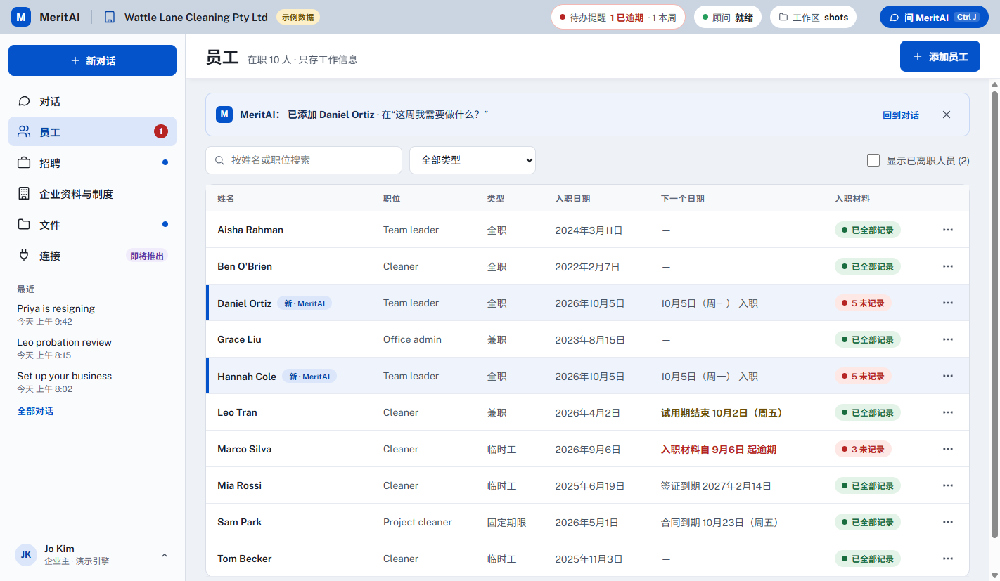
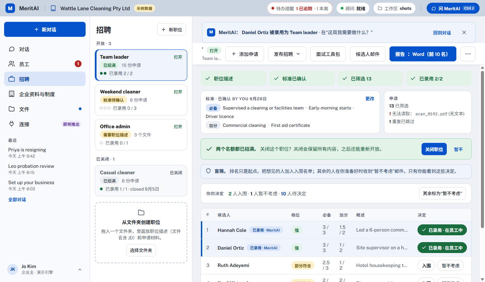

### 12 Your data

**Where things are kept:**
- **Workspace folder:** Inbox, Outbox, Jobs, Policies, the business profile and the register.
- **Your app data:** sign-in, memory, conversations and the voice key.

Conversations are deleted after 30 days.

**What the register refuses:** TFNs, bank details, dates of birth, home addresses and health information.

**Alpha rule:** it runs on your personal ChatGPT sign-in, so use sample or made-up data only.

**Feedback:** use **Was this helpful?** under a reply, and **Send feedback** (bottom left) for a file you send to the MeritAI team.

*Screenshots and video: `node_modules/electron/dist/electron.exe scripts/docs-media.cjs <demo url>` against `npm run ui:fake -- --demo-dir shots --reseed --no-open --port 5190` (see the script's header).*

## Run

```
npm install
npm run login        # first time only: device-code login for the chatbot's own account
npm start            # chat; on the first start it offers the business setup interview
npm start -- --user sarah --tier standard
```

Environment variables:

| Variable | Meaning |
|---|---|
| `FX_USER` | Same as `--user` |
| `FX_TIER` | `fast` (default) or `standard` |
| `FX_DEBUG=1` | Show Codex logs and token counts |
| `FX_SCREEN_LIMIT` / `FX_SCREEN_CONCURRENCY` | Resumes screened per run / in parallel (both default 20) |
| `FX_VOICE_IDLE_SECONDS` | Voice mode stops by itself after this much silence (default 60) |
| `OPENAI_API_KEY` | Log in with an API key instead of ChatGPT |

### Browser UI (MeritAI)

The same assistant in the browser, on this computer only (see `docs/ui.md`):

```
npm run ui:build     # once, and after UI changes
npm run ui           # real engine: opens http://127.0.0.1:<port>/?t=<one-time key> (same account, memory and workspace as the CLI)
npm run ui:demo      # real engine on a separate demo workspace with the design's sample data (synthetic)
npm run ui:fake      # the same demo workspace with scripted replies: no model and no quota
npm run ui:dev       # UI development: hot reload, fake engine
```

In the browser the conversation and the pages stay in step: what the adviser changes shows under its reply ("What changed", with the next step), the pages update at once and mark the changed rows, and a dot marks pages changed while you were elsewhere (a hire said in the chat is the same as Add to Staff). Also: email drafts that open in your email app (MeritAI never sends email), New job from 35 role templates, voice usage and a monthly limit in Settings, Connections (what's coming), and Chinese (Settings › Language; documents stay in English).

Demo options: `-- --reseed` puts the demo workspace back to the design's sample data; `-- --demo-dir <name>` uses a separate copy (e.g. for checks while another demo runs); `FX_FAKE_SIGNED_OUT=1` starts signed out (the first-run screens); `npm run ui:fake -- --fresh` starts from an empty workspace. Voice works in the browser (microphone in Conversations; the demo engine uses a free stand-in voice).

### Desktop app (Windows, the alpha)

```
npm run desktop       # build and run the Electron app from the project
npm run desktop:dist  # the NSIS installer in release/ (see docs/alpha/distribution.md)
```

The app runs the same local server in its own window, with the codex engine inside; the user's data goes to `%APPDATA%MeritAI` and the workspace to `%USERPROFILE%MeritAI`. Testers: `docs/alpha/tester-guide.md`.

Voice mode uses the OpenAI API key saved in the browser UI's Settings (kept encrypted for the Windows user, `src/voice/keyStore.ts`), else `.env` (copy `.env.example`): `VOICE_OPENAI_API_KEY`, `VOICE_MODEL` (default `gpt-live-1`), `VOICE_NAME` (default `gleam`). It needs `ffmpeg` and `ffplay` on PATH. Voice is billed per minute to that key; it is not part of the ChatGPT subscription.

## Chat commands

| Command | What it does |
|---|---|
| `/help` | List commands |
| `/setup` | Set up or update the business profile (a short interview) |
| `/profile` | Show the business profile and the policy documents |
| `/reminders` | Compliance reminders due in the next 30 days or overdue (also shown at startup) |
| `/staff [all]` | List the employee register (`all` includes people who left). Add or change people by telling the assistant; every change is confirmed |
| `/new` | Start a new conversation (saves work notes from the current one) |
| `/history` | List your earlier conversations |
| `/resume <n>` | Continue conversation n from `/history` |
| `/skills` | List skills |
| `/<skill> <request>` | Use a skill explicitly; a unique prefix is enough (e.g. `/int`). Skills are also chosen automatically |
| *drag a file in* | Drag files (PDF, DOCX, TXT, MD, images) into the window: they are copied to the Inbox and attached to your message. Dragging a folder offers to import it as a job |
| `/files` | List your Inbox and show the Jobs/Inbox/Outbox/Policies folders |
| `/files open` | Open the folder in Explorer |
| `/files set <path>` / `/files reset` | Use another business workspace folder / back to the default (`<project>/files`) |
| `/jobs` | List job folders (one per role under `files/Jobs`) |
| `/import <path> [job]` | Copy a folder of resumes (and a JD file) into a job; the job defaults to the folder name |
| `/screen <job>` | Screen a job: draft criteria from its JD file, confirm `[y/n]`, screen up to 20 new resumes, show results in the terminal |
| `/report <job> [word\|excel\|both]` | Save a screening report to the Outbox (Word by default) |
| `/remember <text>` | Save a lasting preference |
| `/memories` | Show your preferences and work notes (with ids) |
| `/forget <id>` | Delete a preference or note |
| `/voice` | Talk instead of typing (GPT-Live); press Enter or Ctrl+C to stop. Headphones recommended |
| `/voice device [n]` | List microphones / pick one |
| `/tier fast\|standard` | Switch speed tier from the next message |
| `/exit` | Quit (saves work notes) |

**Ctrl+C:** while the assistant is replying, it stops the reply; at the prompt, it quits.

## Where to change things

| To change | Edit |
|---|---|
| Facts about the business | `/setup` or tell the assistant in the chat (stored in `files/.assistant/business.json`) |
| The business's own policies | Put documents in `files/Policies/` (PDF, DOCX, TXT, MD) |
| Assistant behaviour | `prompts/base.md` (style, boundaries), `prompts/developer.md` (small-business HR adviser role, HR principles), `prompts/memory.md` (profile, policy and memory rules) |
| Skills | `codex_home/skills/<name>/SKILL.md` |
| Model, sandbox, disabled Codex features | `codex_home/config.toml` |
| Official websites allowed for legal lookups | `OFFICIAL_DOMAINS` in `src/research/officialSources.ts` |

Changes take effect from the next conversation (`/new`) or the next start.

## Tests

These run against the real model and use synthetic data only. Apart from `test:business`, the suites use a synthetic test business (`scripts/fixtures/business.ts`).

Tests, `npm run eval` and the `ab:*` experiments use their own engine folder, `codex_home_test/` (gitignored), so their conversations never mix with yours. It has its own sign-in: run `npm run login:test` once (same account, a second device login). Our `config.toml` and skills are copied into it from `codex_home/` on every run.

| Command | Covers |
|---|---|
| `npm run e2e` | Streaming, multi-turn, interrupt, no command execution |
| `npm run test:business` | Business profile (setup interview, used in drafts, chat edits with confirmation), no-profile placeholders, advice referral without an adviser, drag and drop (files and images) |
| `npm run test:hiring` | New starter checklist per employment type, offers and contracts (banner, profile details, information statements, unlawful clauses refused), onboarding compliance |
| `npm run test:register` | Employee register: validation, add / update / record documents / leave / delete via the chat with confirmation, sensitive data refused |
| `npm run test:reminders` | Reminder date rules (CEIS, employee choice, probation, visa, fixed-term, paperwork, 1 July) and the owner asking what to do |
| `npm run test:award` | Award and level with reasons, no pay calculations (plus the client-side guard), recording the award, a café with unclear coverage |
| `npm run test:skills` | Skill routing, fairness in screening, no invented company claims, profile signer |
| `npm run test:memory` | Profile facts, policies on demand, preferences, proposals, session notes, resume, user isolation |
| `npm run test:screening` | Bulk screening: blind masking, ingest/dedupe, criteria confirmation, ranking, results in chat, Word/Excel on request, cache, batch limit, chat flow, retention |
| `npm run test:hr` | Onboarding, performance (bias), ER advice referral, termination drafts, wellbeing, policy + law, no names in notes |
| `npm run test:voice` | GPT-Live delegation to the HR assistant with synthetic speech (EN + ZH, follow-up, small talk); needs the voice key; **costs about US$0.10 per run** (prints the billed seconds) |
| `npm run test:files` | Inbox/Outbox guards, PDF/DOCX/TXT/MD parsing, docx output, screening from files, injection in documents |
| `npm run test:research` | Official-source lookups, domain allowlist, no URLs from memory, prompt injection |
| `npm run inspect` | Which skills, plugins, MCP servers, apps and features Codex exposes |
| `npm run test:unit` | Free unit checks (no model calls): apprentices, leaving checklist, fixed-term notes, reminder wording, small business status; the server protocol, changes and hires, voice on screen, usage, email drafts, job templates, Chinese |
| `npx tsx scripts/journeys.ts [ids]` | Owner journeys with the real model through the UI's server session on copies of the sample business: the saved data and that every change reached its reply (about 30 journeys; uses the ChatGPT quota) |
| `npm run typecheck` | Type check |

After upgrading `codex`, run `npm run gen:protocol`, then all of the above.

**Evaluation** (quality and reliability, not just "does it work"): `npm run eval` runs the core set (70 realistic owner scenarios across 9 synthetic businesses, 2 runs each, sized for one Codex 5-hour window) with hard checks and a stronger model as judge; `npm run eval:report` writes the report and `npm run eval:compare` compares two runs. The full set has 210 scenarios. Uses the ChatGPT quota; resumable. See [docs/eval.md](docs/eval.md).

## Data

- **`files/`** is the business workspace: Jobs, Inbox, Outbox, Policies, and `.assistant/` with the business profile, the screening catalog and the employee register.
- **`memory/`** holds per-user memory.
- **`codex_home/sessions/`** holds conversation transcripts, which are deleted after 30 days (the list of them is read from Codex's own index, `codex_home/state_5.sqlite`). Test and eval conversations go to `codex_home_test/` instead.

All three are local and not in git. The chatbot is currently logged into a personal ChatGPT account, so **do not paste real candidate or employee data** until it uses an approved account.

Australian employment law questions (pay, awards, leave, notice, visas, privacy, discrimination, WHS) are looked up on official government websites and answered with sources. This takes about 15-25 s.

**Jobs and files:** put each role's resumes (any subfolders; PDF, DOCX, TXT, MD) in `files/Jobs/<job>/`, optionally with a JD file named `JD...`, then ask "screen the <job> applicants" or run `/screen <job>`. You can also drag the folder into the chat. You confirm the criteria first, and the results appear in the chat. Ask for a report (Word by default, Excel on request) and it is saved to `files/Outbox`. Loose documents go in `files/Inbox`, or drag them into the chat. Nothing is ever overwritten.

Design notes: [docs/architecture.md](docs/architecture.md), [docs/business.md](docs/business.md), [docs/screening.md](docs/screening.md), [docs/memory.md](docs/memory.md), [docs/research.md](docs/research.md), [docs/files.md](docs/files.md), [docs/voice.md](docs/voice.md). Step-by-step manual test: [docs/manual-test.md](docs/manual-test.md).
