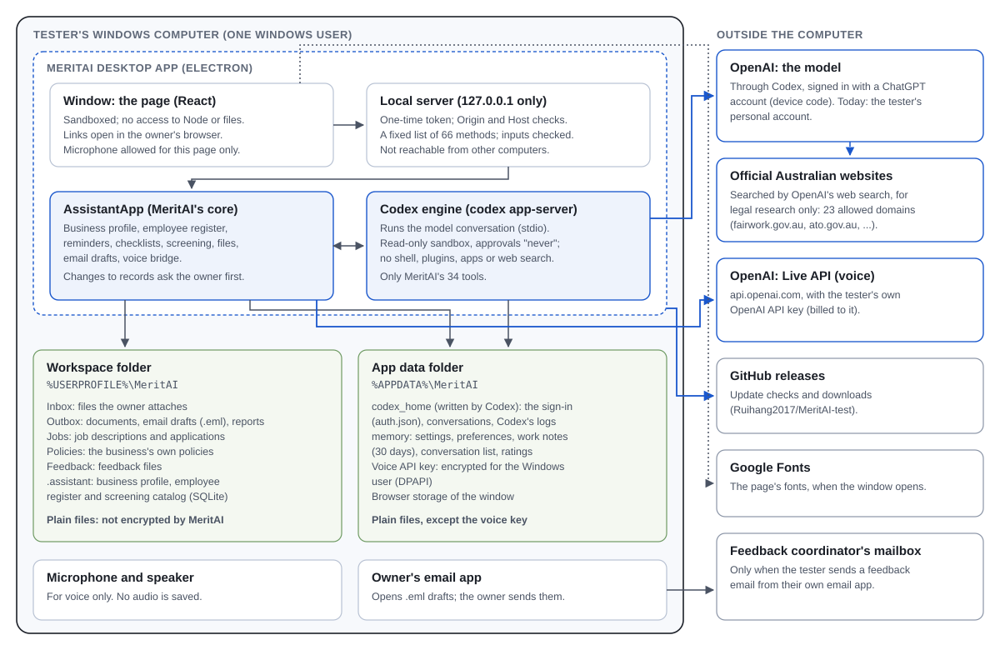
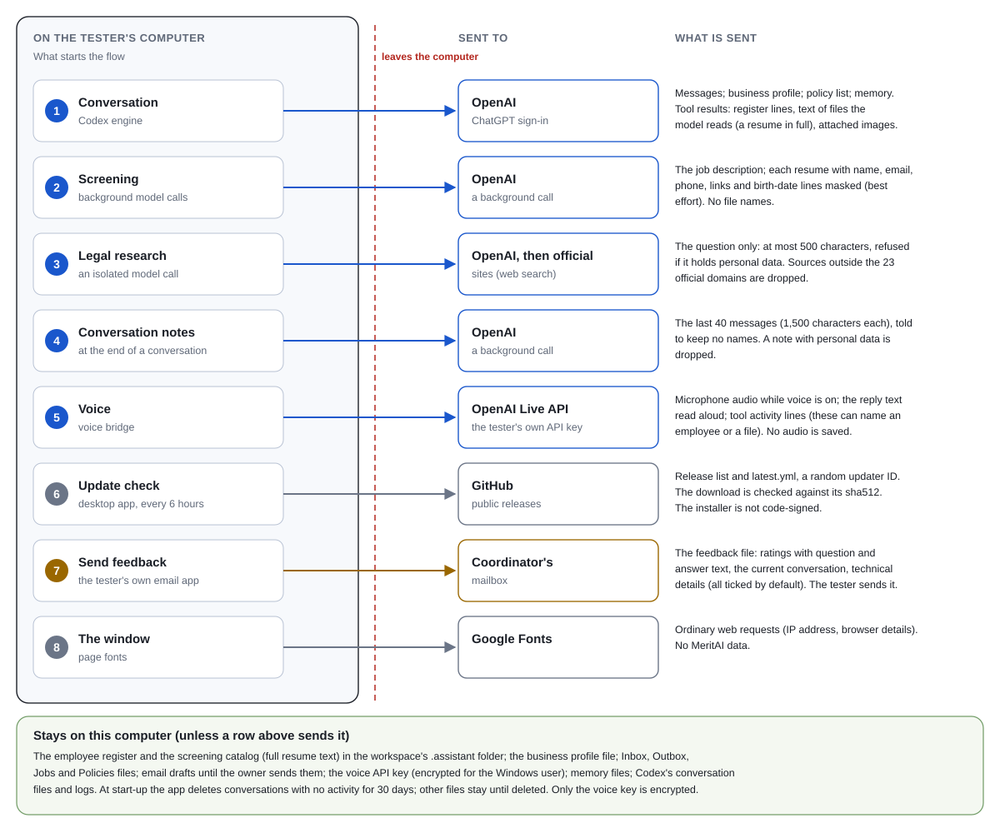
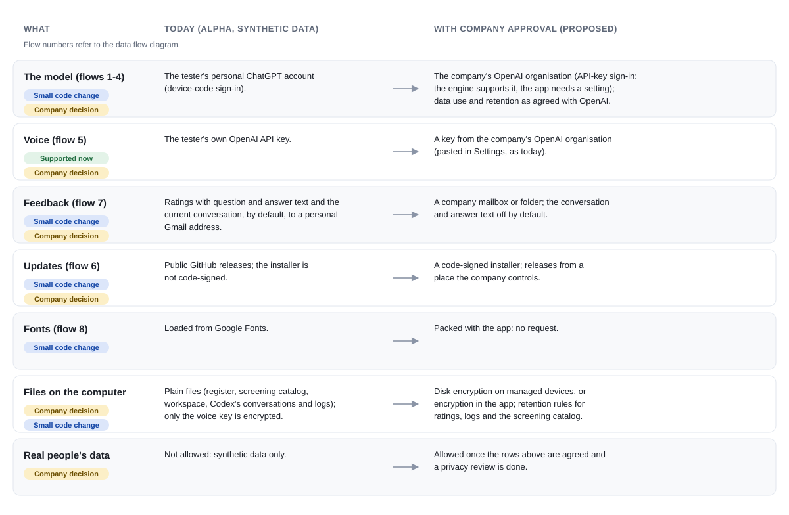

# MeritAI: data and security

For the company's IT and security reviewers and its legal and privacy reviewers. It describes MeritAI as built (version 0.2.2, September 2026): what it stores, what leaves the computer, the controls, the known limits, and the decisions needed before it may handle real candidate or employee data. Statements come from the source code (`file:line` references in section 9); behaviour inside the Codex engine and at OpenAI is marked as not verified here.

## 1. Summary

MeritAI is an HR adviser for small business owners without an HR department. It is a Windows desktop app (Electron) that runs OpenAI's Codex engine locally and gives the model only MeritAI's own tools. Today it is an internal alpha: testers play a business owner, **with synthetic data only**, signed in to their own ChatGPT account.

- **On the computer:** the business profile, employee register, screening catalog, workspace files and settings are plain files in the Windows user's folders; only the voice API key is encrypted.
- **Leaving the computer:** conversations, the business profile and what the model reads go to OpenAI (flows 1 to 5 below); update checks go to GitHub; fonts come from Google; feedback goes by email only when the tester sends it.
- **Not allowed yet:** real candidate or employee data. Section 8 lists what would have to change and what the company needs to decide.

## 2. Architecture

| Part | What it does | Boundary |
|---|---|---|
| Window (React page) | The screens | Electron sandbox, context isolation, no Node access; external links open in the browser; microphone allowed for this page only |
| Local server | Connects the window to the core | Listens on 127.0.0.1 on a random port; a one-time token; Origin and Host checks; a fixed list of 66 methods with checked inputs |
| AssistantApp (core) | Business profile, register, reminders, checklists, screening, files, email drafts, voice | Every change to the profile, the register or hiring records asks the owner yes or no first |
| Codex engine (`codex app-server`) | Runs the model conversation over stdio | Read-only sandbox; approvals "never" (requests are declined); shell, plugins, apps, connectors, web search, multi-agent, browser and computer use disabled; only MeritAI's 34 tools |

## 3. Data that leaves the computer

| # | Flow | Destination and account | What is sent | Controls |
|---|---|---|---|---|
| 1 | Conversation | OpenAI, through Codex, signed in with a ChatGPT account (device code). An `OPENAI_API_KEY` in the environment switches to API-key sign-in | The owner's messages (up to 20,000 characters); instructions with the full business profile, the list of policy documents and memory (preferences, the 5 latest work notes, the Windows user name); tool results: register lines (names, roles, dates, award, visa expiry, notes), the text of files the model reads (a resume in full, unmasked, up to 60,000 characters), candidate names; attached images. Other attachments are sent only if the model reads them | Only MeritAI's tools; no shell or file system access for the model; file tools reach only the workspace's folders |
| 2 | Screening | OpenAI, one background call per resume | The job description (unmasked); each resume with emails, links, phone numbers, lines about date of birth or age and the candidate's name masked (best effort: an address or a name written elsewhere is not). No file names. The screening summary returned to the conversation has candidate names | Evaluation is blind and scored against criteria the owner confirmed |
| 3 | Legal research | OpenAI, an isolated background call with web search | The research question only: at most 500 characters, refused if it contains personal data | Web search limited to 23 official Australian domains; sources outside them are dropped (the search itself may still open other pages: an OpenAI tool limitation) |
| 4 | Conversation notes | OpenAI, a background call when a conversation ends | The last 40 messages, each cut to 1,500 characters, with instructions to keep no names | A note containing personal data (email, phone, TFN, date of birth) is dropped |
| 5 | Voice | OpenAI Live API (`api.openai.com`), with an OpenAI API key the tester pastes in Settings | Microphone audio while voice is on; the reply text read aloud (up to 1,200 characters); tool activity lines (can include an employee's name or a saved file's path). The spoken words come back as text and go into flow 1 | Stops after 60 seconds of silence and at the tester's monthly limit; no audio is saved |
| 6 | Updates | GitHub, public releases of `Ruihang2017/MeritAI-test` | Requests for the release list and `latest.yml`, a random updater ID; downloads the installer | Checked against the sha512 in `latest.yml`; the installer is not code-signed, so this proves integrity, not the publisher |
| 7 | Feedback | The feedback coordinator's mailbox (today a personal Gmail address), sent by the tester from their own email app | A feedback file: all ratings with the question and answer text, the current conversation, technical details (versions, model, recent errors), an optional tester name. All parts are ticked by default | MeritAI never sends email itself; the tester sees the draft first |
| 8 | Fonts | Google Fonts | Ordinary web requests (IP address, browser details) | No MeritAI data |

Not found in the code: telemetry, analytics or crash reporting (Codex's analytics is turned off in its config). MeritAI never sends email: `draft_email` saves an unsent `.eml` in the Outbox for the owner's email app.

Not verified here: which OpenAI endpoints Codex uses, what OpenAI keeps from flows 1 to 5 and for how long, and whether it may use them for training under a personal ChatGPT plan. These depend on OpenAI's terms and the account's settings.

## 4. Data on the computer

| Where | What | Protection | Kept |
|---|---|---|---|
| `%USERPROFILE%\MeritAI` (the workspace; the owner can move it) | Inbox (attachments), Outbox (documents, email drafts, screening reports with candidate names), Jobs (job descriptions, resumes), Policies, Feedback files | Plain files | Until deleted |
| Workspace `.assistant\` (no tool can reach it) | `business.json` (profile: names, ABN, address, headcount, adviser, and more), `register.sqlite` (employee register: work details only), `catalog.sqlite` (screening: full resume text, names, model evaluations) | Plain files | Until deleted; screening data goes with its job folder |
| `%APPDATA%\MeritAI\codex_home` (written by Codex) | The sign-in (`auth.json`), full conversations, Codex's own logs and databases | Plain files | Conversations: deleted at start-up once they have had no activity for 30 days. Logs: not managed by MeritAI |
| `%APPDATA%\MeritAI\memory` | Settings, preferences, work notes, the conversation list, change summaries per reply, ratings (with question and answer text), voice usage | Plain files; the voice API key is encrypted with Windows DPAPI for the Windows user | Work notes 30 days; ratings and preferences until deleted |
| `%APPDATA%\MeritAI` (Electron) | The window's cache and storage (the local server's token for the session, the microphone choice) | Plain files | Browser defaults |

What MeritAI refuses to store: the register rejects tax file numbers, bank details, dates of birth, home addresses and health details (names, notes and other text fields are checked); memory rejects emails, phone numbers, TFNs and dates of birth.

## 5. Security controls

- **The model's capabilities** are an allowlist in Codex's config: a read-only sandbox, no approvals, no shell, no plugins or apps, no web search in conversations, no multi-agent, browser or computer use, no image generation, and 6 built-in skills disabled. Each conversation is started with the same settings. The model gets only MeritAI's tools, and MeritAI's skills load only from its own list.
- **Owner confirmation** for every change to the business profile, the register, hiring decisions and remembered preferences.
- **File access** only through MeritAI's tools, only inside the workspace's Inbox, Outbox, Jobs and Policies folders (no hidden files, no links out, no path tricks); the `.assistant` folder, the app's own folders and system folders are refused.
- **Research isolation**: legal questions run in a separate call that sees only the question; no web access in conversations, so a resume with hidden instructions cannot make the model browse.
- **Links**: a link in a reply that no tool returned is flagged and shown unclickable.
- **Pay**: replies that calculate pay are flagged; pay rates come only from the Fair Work tools.
- **Local server**: 127.0.0.1 only, a random port, a one-time token, Origin and Host checks, a method allowlist, a content security policy.
- **Voice key**: encrypted for the Windows user; shown only as its last 4 characters.

## 6. Known limits

1. Everything on the computer is plain text except the voice key, including Codex's `auth.json` (the ChatGPT sign-in), conversations and logs.
2. Resume masking for screening is best effort, and a resume the model reads in a conversation is sent in full.
3. Feedback files include the current conversation and every rating's question and answer text by default, and go to a personal Gmail address.
4. The 30-day deletion covers conversations only (at the next start-up), not ratings, Codex's logs, the screening catalog or workspace files.
5. The installer is not code-signed and updates come from a public GitHub repository: whoever controls that repository can ship an update.
6. Voice tool activity lines can carry an employee's name or a file path to OpenAI.
7. The model sees the Windows user name (in memory).
8. Codex's own behaviour (endpoints, what its logs hold, whether deleting a conversation removes every copy) was not examined.

## 7. Target state

## 8. Decisions for the company

**IT and security**

1. The OpenAI account: an OpenAI organisation of the company, used with an API key (the engine supports it; the app needs a setting), instead of personal ChatGPT accounts. The same organisation for voice keys.
2. Devices: company-managed Windows devices with disk encryption, or encryption inside MeritAI for the register, the screening catalog and Codex's files.
3. Distribution: a code-signing certificate, and where releases come from (a company-controlled repository or share), and who can publish them.
4. Retention: how long to keep conversations, ratings, Codex's logs and screening data, and whether they should be deleted on a timer as well as at start-up.
5. Network: whether fonts should be packed with the app (removes the Google request).

**Legal and privacy**

1. OpenAI's terms for the chosen account: data use for training, retention, where data is processed, and a data processing agreement.
2. Whether candidate resumes (flows 1 and 2) and employee register details (flow 1) may be sent to OpenAI under those terms, and what candidates and employees need to be told.
3. Feedback: a company mailbox or folder instead of a personal address, and whether conversation and answer text may be included (MeritAI can turn them off by default).
4. Voice: whether employee or candidate matters may be discussed by voice (audio and transcripts go to OpenAI).
5. A privacy impact assessment before real data is used.

## 9. Evidence

The main references, for a reviewer who wants to check the code (paths in the repository):

| Topic | Where |
|---|---|
| Folders by app name | `src/desktop/main.ts`, `src/server/desktop.ts` |
| Codex settings (allowlist) | `codex_home/config.toml`; thread settings in `src/engine/appServer.ts` |
| Tools and confirmations | `src/assistant.ts`; `src/business/registerTools.ts`, `src/business/tools.ts` |
| File guards | `src/files/folders.ts`, `src/files/attach.ts`, `src/app/launch.ts` |
| Screening and masking | `src/screening/pipeline.ts`, `src/screening/blind.ts` |
| Research isolation | `src/research/officialSources.ts` |
| Memory rules and notes | `src/memory/store.ts`, `src/memory/summarize.ts` |
| Register rules | `src/business/register.ts` |
| Voice | `src/voice/liveSession.ts`, `src/voice/bridge.ts`, `src/voice/keyStore.ts` |
| Feedback | `src/app/feedback.ts`, `src/app/app.ts` (`exportFeedback`, `emailFeedback`), `web/src/components/Feedback.tsx` |
| Updates | `src/desktop/updates.ts`, `package.json` (`build.publish`) |
| Local server | `src/server/server.ts`, `src/server/session.ts` |
| Conversation retention | `src/app/app.ts` (`SESSION_RETENTION_DAYS`, `cleanupOldSessions`) |

The Word version of this document is built with `npx tsx scripts/build-data-security.mjs` (release/MeritAI data and security.docx); the diagrams are the SVG files in `docs/images/`.
