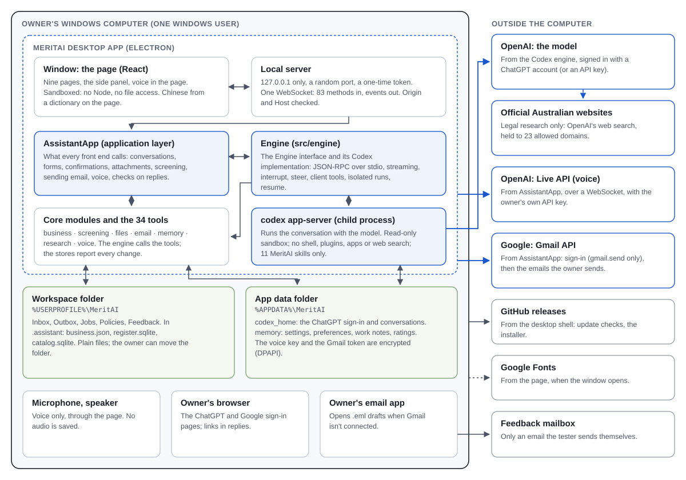
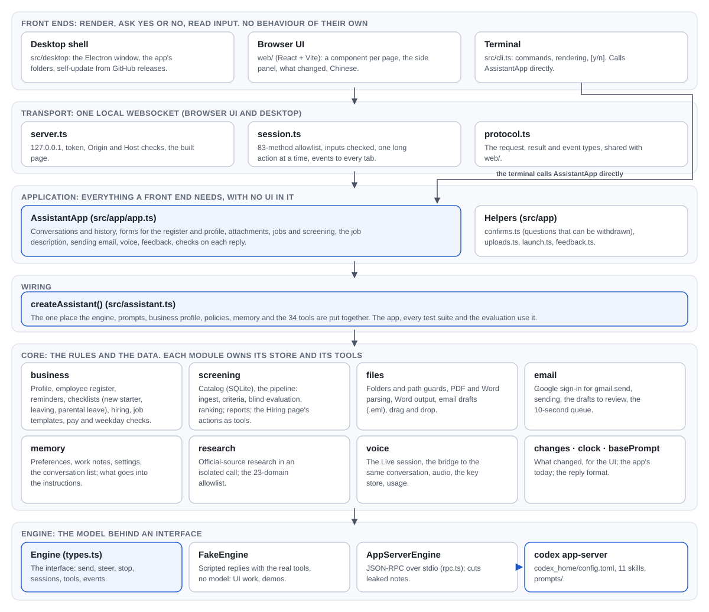
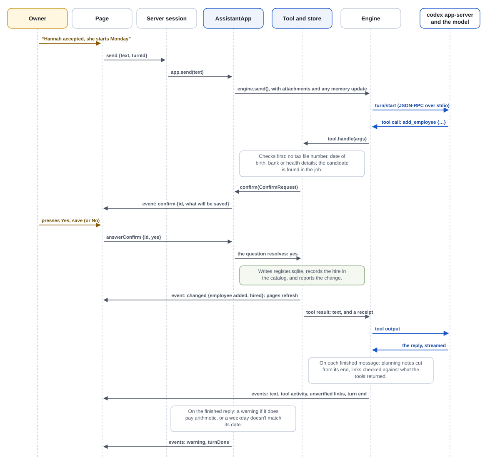
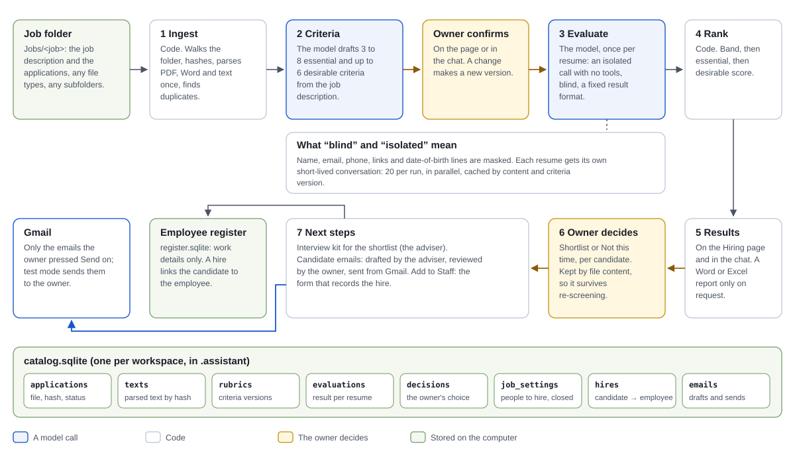
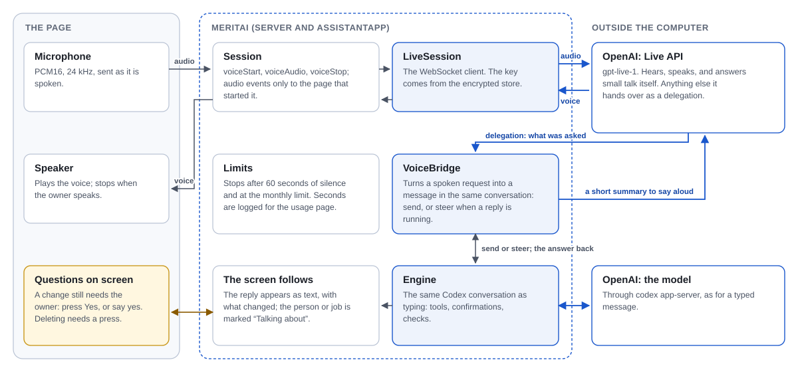
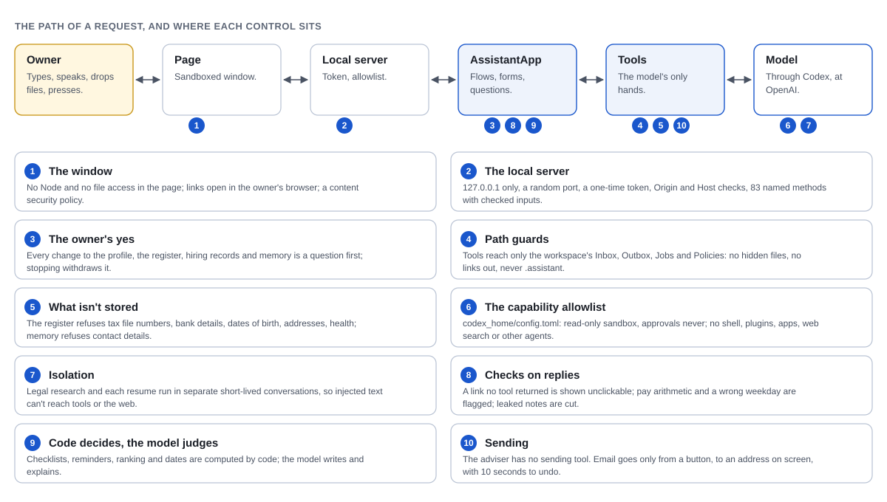

# MeritAI: system design (as built)

For developers and architecture reviewers. It describes MeritAI as built (version 0.2.2, October 2026): what runs where, how the parts depend on each other, how one reply and the two longer workflows (screening, voice) run, where the data lives, and why the main design choices were made. Details of each part are in the documents linked from each section; data protection and the decisions needed before real data are in `docs/data-and-security.md`.

## 1 What the system is

MeritAI is an HR adviser for small business owners with no HR department: the owner says what is happening, it tells them what to do and gets the paperwork done after their OK. It is a Windows desktop app. Everything runs on the owner's computer except the model, which is OpenAI's, reached through a local `codex app-server` process.

Three ideas shape the whole design:

1. **The model advises and writes; code decides and records.** Checklists, reminders, dates, ranking and every write to the business's records are code. The model gets 34 narrow tools and nothing else: no shell, no file system, no web.
2. **The owner approves every change.** A tool that would change the profile, the register, hiring records or memory asks first; email goes only when the owner presses Send.
3. **Behaviour lives below the user interface.** One application layer (`AssistantApp`) serves the desktop app, the browser version and the terminal, so they cannot drift apart.

## 2 System overview

**On the computer.** The desktop app is one Electron process tree:

| Part | What it is | Notes |
|---|---|---|
| Window | The page: React, built by Vite (`web/`) | Sandboxed: no Node integration, no file access; everything goes through the local server |
| Local server | `src/server/`: HTTP for the built page, one WebSocket for requests and events | 127.0.0.1 only, a random port, a one-time token, Origin and Host checks, 83 named methods |
| AssistantApp | `src/app/app.ts`: the application layer | One per process, like one owner at one computer |
| Core modules | `src/business`, `screening`, `files`, `email`, `memory`, `research`, `voice` | Own the stores and the 34 tools |
| Engine | `src/engine`: the `Engine` interface and `AppServerEngine` | JSON-RPC over the child process's stdio |
| codex app-server | OpenAI's Codex engine, started as a child process | Holds the conversation with the model; configured by `codex_home/config.toml` |

**Two folders.** The workspace (`%USERPROFILE%\MeritAI`, which the owner can move) holds the business's files and, in `.assistant`, three stores: `business.json`, `register.sqlite`, `catalog.sqlite`. The app data folder (`%APPDATA%\MeritAI`) holds Codex's own home (the sign-in, conversations) and MeritAI's memory folder (settings, preferences, work notes, ratings, the encrypted voice key and Gmail token). The folders follow the app's .exe name, so a test build can't touch an installed MeritAI.

**Outside.** Six services, each reached by one part of the app for one purpose:

| Service | Reached by | For | Sign-in |
|---|---|---|---|
| OpenAI: the model | codex app-server | Conversations, criteria, resume evaluation, notes | The owner's ChatGPT account (device code), or an API key |
| Official Australian websites | OpenAI's web search, inside an isolated call | Legal research only, held to 23 domains | None |
| OpenAI: Live API | `src/voice/liveSession.ts` | Voice | The owner's own OpenAI API key |
| Google: Gmail API | `src/email/gmail.ts` | Sending the emails the owner pressed Send on | OAuth, `gmail.send` only |
| GitHub releases | `src/desktop/updates.ts` | Update checks and the installer | None (public) |
| Google Fonts | The page | Fonts | None |

There is no MeritAI server: nothing is sent to its developer except a feedback email the tester sends themselves.

## 3 Layers and modules

Each layer uses only the one below it.

| Layer | Code | Responsibility | Must not |
|---|---|---|---|
| Front ends | `src/desktop/`, `web/`, `src/cli.ts` | Render data and events, ask yes or no, read input | Hold behaviour or rules |
| Transport | `src/server/server.ts`, `session.ts`, `protocol.ts` | Carry the page's requests to AssistantApp and push events back; check every input; run one long action at a time | Know about the model or the stores |
| Application | `src/app/app.ts` and helpers | Session flows, forms, confirmations that can be withdrawn, attachments, screening, email sending, voice, checks on replies | Depend on any UI |
| Wiring | `src/assistant.ts` (`createAssistant`) | Put together the engine, prompts, profile, policies, memory and tools | Be bypassed: the app, the tests and the evaluation all use it |
| Core | `src/business`, `screening`, `files`, `email`, `memory`, `research`, `voice` | The rules, the stores and the tools | Call a front end |
| Engine | `src/engine` | Threads, streaming, interrupt, steer, client tools, isolated runs, resume | Know HR |

**The core modules:**

| Module | Owns | Tools it gives the model |
|---|---|---|
| `business` | Business profile, employee register (work details only), reminders, new starter, leaving and parental leave checklists, hiring links, job templates, pay and weekday checks | `update_business_profile`, `read_policy`, `add_employee`, `update_employee`, `record_documents`, `remove_employee`, `list_employees`, `new_starter_checklist`, `leaving_checklist`, `casual_to_permanent`, `parental_leave_checklist`, `get_reminders`, `pay_check_tools` |
| `screening` | The catalog, the screening pipeline, reports, the Hiring page's actions | `list_jobs`, `job_status`, `propose_criteria`, `confirm_criteria`, `screen_candidates`, `save_screening_report`, `read_job_file`, `list_candidates`, `decide_candidates`, `record_hire`, `update_job`, `set_job_description`, `add_applications`, `create_job` |
| `files` | Folders and path guards, parsing (PDF, Word, text), Word output, email drafts | `list_files`, `read_file`, `save_document`, `draft_email` |
| `email` | Google sign-in, sending, the review list, the 10-second queue | None: sending is the owner's button |
| `memory` | Preferences, work notes, settings, conversation list | `remember`, `propose_memory` |
| `research` | Official-source research, the domain allowlist | `search_official_sources` |
| `voice` | The Live session, the bridge to the conversation, audio, the key store, usage | None |

Cross-cutting: `src/changes.ts` (every store reports what it changed, for the UI), `src/clock.ts` (the app's today), `src/basePrompt.ts` (plain or markdown replies). Prompts are files (`prompts/base.md`, `developer.md`, `memory.md`, `voice.md`); the 11 skills are folders under `codex_home/skills/`, loaded on demand by a tool.

The `Engine` interface has two implementations: `AppServerEngine` (the real one) and `FakeEngine` (scripted replies that call the real tools, for UI work and demos without the model).

More: `docs/architecture.md` (the AssistantApp API), `docs/ui.md` (the pages).

## 4 One reply, end to end

The example is "Hannah accepted, she starts Monday", which ends with Hannah in the employee register and the job counting a hire.

1. **In.** The page sends `send {text, turnId}`; the session calls `AssistantApp.send`, which adds pending attachments and, if memory or the language changed, a short update for the model, then `engine.send`.
2. **The model decides to act.** Codex returns a tool call. The engine finds the tool among the 34 and runs its handler in MeritAI's own process.
3. **The tool checks, then asks.** `add_employee` validates the details (and refuses tax file numbers, dates of birth, bank or health details), finds the candidate in the job, then calls `confirm` with a structured `ConfirmRequest`. AssistantApp tracks the question and the session shows it on the page. Stopping the reply, closing the app or starting a new conversation withdraws an open question, which then counts as "no".
4. **The owner answers; the store writes.** On yes the tool writes `register.sqlite`, links the hire in the catalog, and the stores report the change (`src/changes.ts`). The session pushes a `changed` event: open pages refresh, the changed row is marked, and the reply gets a "What changed" card.
5. **The reply.** The tool's result goes back to the model, which writes the reply; it streams to the page as events.
6. **Checks on the way out.** On each finished message the engine cuts the model's own planning notes from its end and compares its links with what the tools returned (a link no tool returned is shown unclickable; a near-miss of a real one is corrected). On the finished reply AssistantApp flags pay arithmetic and a weekday that doesn't match its date.

The same path serves a form on a page: a form calls AssistantApp directly (no model), with the same validation, and submitting is the confirmation. That is why a hire said in the chat and a hire made with the Add to Staff button are the same thing.

## 5 Screening and hiring

Screening is a workflow run by code; the model is called at two fixed points and only for judgement.

| Step | Who | What |
|---|---|---|
| 1 Ingest | Code | Walk `Jobs/<job>`, hash each file, parse new ones once, mark duplicates |
| 2 Criteria | Model | Draft 3 to 8 essential and up to 6 desirable criteria from the job description; protected attributes excluded |
| Confirm | Owner | Nothing is screened against criteria the owner hasn't confirmed; an edit makes a new version |
| 3 Evaluate | Model | One isolated, tool-less call per resume, on masked text (name, email, phone, links, date of birth), with a fixed result format: per criterion met / partly / not evidenced, with the evidence quoted |
| 4 Rank | Code | Band (Strong, Partial, Weak, Not a resume), then essential, then desirable score |
| 5 Results | Code | On the Hiring page and as a chat summary; a Word or Excel report only on request |
| 6 Decide | Owner | Shortlist or Not this time, kept by file content |
| 7 Next steps | Adviser and owner | Interview kit; candidate emails (drafted by the adviser, reviewed and sent by the owner); Add to Staff, which records the hire |

Why this shape: it scales (each resume is one short call, 20 in parallel, cached by content and criteria version, so nothing is evaluated twice); it is consistent (every resume against the same confirmed criteria, with evidence that can be checked, and a rule-based ranking); and it is contained (an evaluator has no tools, so a resume with instructions written into it can at most distort its own evaluation, and is flagged).

More: `docs/screening.md`, `docs/business.md`.

## 6 Voice

Voice adds a second model for hearing and speaking; the thinking stays in the same Codex conversation as typing.

- The page captures the microphone (PCM16, 24 kHz) and sends it through the session to `LiveSession`, a WebSocket to OpenAI's Live API (`gpt-live-1`).
- The Live model answers small talk itself. Anything else it hands over as a **delegation**. `VoiceBridge` turns it into a message on the current conversation: `send`, or `steer` when a reply is already running.
- Progress goes back as quiet "thinking" notes, and the finished answer as a short summary for the Live model to say aloud. The full answer is on the screen.
- A change still needs the owner: the question waits on screen and can be answered by a press or by saying yes; deleting needs a press.
- Voice stops after 60 seconds of silence and at the owner's monthly limit; billed seconds are logged for the usage page. The API key is the owner's own, encrypted for the Windows user.

More: `docs/voice.md`.

## 7 Data

| Store | Where | Format | Written by |
|---|---|---|---|
| Business profile | `<workspace>\.assistant\business.json` | JSON | `business/profile.ts`, after a yes |
| Employee register | `<workspace>\.assistant\register.sqlite` | SQLite | `business/register.ts`, after a yes |
| Screening catalog | `<workspace>\.assistant\catalog.sqlite` | SQLite: applications, texts, rubrics, evaluations, decisions, job_settings, hires, emails | `screening/catalog.ts` |
| Business files | `<workspace>\Inbox`, `Outbox`, `Jobs`, `Policies`, `Feedback` | The owner's own files | Tools (Outbox, Jobs), the owner |
| Memory | `%APPDATA%\MeritAI\memory` | JSON and JSON lines: settings, preferences, work notes (30 days), conversation list, ratings, voice usage | `memory/store.ts` |
| Secrets | Same folder: `voice-key.json`, `gmail.json` | Encrypted with Windows DPAPI for the Windows user | `voice/keyStore.ts`, `email/gmail.ts` |
| Conversations and sign-in | `%APPDATA%\MeritAI\codex_home` | Codex's own files | codex app-server |

One workspace is one business. Deleting a job's folder deletes its screening data. Conversations with no activity for 30 days are deleted at start-up. No tool can reach `.assistant`.

More: `docs/data-and-security.md` (every flow off the computer, what is and isn't encrypted, the known limits), `docs/memory.md`, `docs/files.md`.

## 8 Controls

The boundary that matters most is around the model. It is drawn in three places, so one failing doesn't open it:

- **What Codex may do** (`codex_home/config.toml`): a read-only sandbox, approvals "never", and shell, plugins, apps, web search, other agents, browser and computer use all off. Only MeritAI's own skills load.
- **What the tools may do**: each tool is narrow, checks its input, reaches only the workspace's four folders through path guards, and asks before it changes anything.
- **What reaches the owner**: links are checked, pay arithmetic and wrong weekdays flagged, planning notes cut.

Two things that read untrusted text run apart from the conversation: legal research (it sees only the question, and its web search is held to official domains) and resume evaluation (no tools at all). The reason is that a pasted resume or document can contain instructions aimed at the model; with no web access and no tools in reach, such instructions have nothing to act through.

Prompt rules are treated as likely, not certain: anything that must always hold has a check in code.

## 9 Design decisions

| Decision | Why |
|---|---|
| `codex app-server`, not one-shot calls | Streaming, interrupt, steer, client tools and resumable conversations; voice could be added on the same conversation |
| The engine behind an interface | The fake engine makes UI work, demos and unit tests free; another model provider would be one new implementation |
| MeritAI's own base prompt instead of Codex's coding prompt | About half the input tokens, the same quality |
| Client tools only; no shell even to read skills | The allowlist is the security boundary; skills load through a tool |
| Business facts only from the profile and the Policies folder | Skills and prompts stay generic; nothing about a business is invented |
| Checklists, reminders and ranking in code, each item linked to an official page | They must be right every time, and the sources can be checked |
| No pay calculation | Rates come from the Fair Work tools; a reply that calculates pay is flagged |
| Screening as a code-run pipeline with isolated, blind evaluation | Scale, consistency, and containment of injected instructions |
| One application layer for every front end | The terminal, the browser version and the desktop app behave the same; tests exercise the same code |
| A local WebSocket, not Electron IPC | The same page runs in a browser for development and in the desktop app |
| The stores report their own changes | The conversation and the pages stay in step whoever made the change |
| UI text translated on the page from a dictionary | Components stay in English; documents for the workplace stay in English |
| The adviser drafts email; a button sends it | Sending can't be undone, so it is never the model's action; test mode and a 10-second undo |
| Tests and evaluations in their own Codex home | They don't fill the owner's conversation list or share its sign-in |

The dated list, with the owner's wording, is in `CLAUDE.md`.

## 10 Build, release, test

- **Build.** `npm run desktop:dist`: Vite builds the page; esbuild bundles the main process and the whole server into one module (the Google OAuth client is built in from `.env`); electron-builder makes the Windows installer.
- **Release.** A GitHub release, as a draft first: the installer is tried on one computer, then published. Installed copies check for updates at start-up and every 6 hours, download in the background, and install when the owner restarts (`docs/alpha/distribution.md`).
- **Tests.** `npm run test:unit` is free (53 groups, no model): the application layer, the server protocol, the stores, the guards, Gmail's sign-in against a stand-in Google. Twelve suites call the real model on synthetic data (`e2e`, `test:hr`, `test:hiring`, `test:screening`, and so on); `scripts/journeys.ts` runs the owner's flows through the server session.
- **Evaluation.** About 200 scenarios across 9 synthetic businesses, with hard checks and a stronger model as judge; a core set of 70 fits one usage window (`docs/eval.md`).

## 11 Limits of this version

- One owner, one computer: no accounts, no sharing, no server. A shared deployment would need authentication and one engine per user.
- The model account is the owner's personal ChatGPT plan, with usage windows; real candidate or employee data waits for a company-approved account.
- Stores are plain files, except the two secrets; the installer isn't code-signed.
- Resume name masking is best effort; scanned PDFs can't be read.
- Gmail's OAuth client isn't verified by Google (a warning at sign-in, 100 users at most); Outlook isn't built.
- The app-server protocol is experimental: after upgrading Codex, the protocol types are regenerated and every suite rerun.

The Word version of this document is built with `npx tsx scripts/build-data-security.mjs docs/system-design.md "release/MeritAI system design.docx" "MeritAI: system design"`; the diagrams are the SVG files in `docs/images/`.
